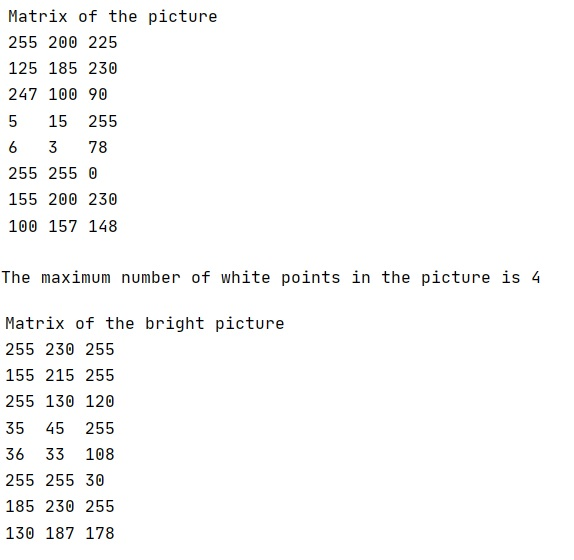

# Bright-a-picture
Java course exercise using 2D arrays

The goal was to generate a **2D array** to store *picture coefficient code* and to be able to :

1. value the number of white colour (number 255) selected in the matrix
2. bright the picture by adding 30 for each matrix coefficient without exceeding 255

The program is composed by :
* Picture class which contains the main method
* CheckInput class to ensure the input selected by user is only based on integers
* CheckColour class to ensure the input is in between 0 and 255
* Calculation class to count the number of white points and to bright the picture
* Display to show to console the matrix

